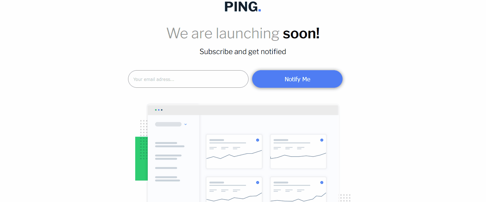

# Frontend Mentor - Ping coming soon page

This is a solution to the [Interactive rating component challenge on Frontend Mentor](https://www.frontendmentor.io/challenges/interactive-rating-component-koxpeBUmI).

 

## Sumário

- [Visão geral](#visão-geral)
    - [Nota](#nota)
  - [O Desafio](#o-desafio)
  - [Screenshot](#screenshot)
- [Links](#links)
- [Meu processo](#meu-processo)
  - [Tecnologias](#tecnologias-usadas)
  - [O que eu aprendi](#o-que-aprendi)
  - [Dificuldades](#dificuldades)
- [Contato](#contato)

## Visão Geral

### Nota
Por se tratar de um desafio de um site em inglês resolvi codar em inglês, para praticar e manter o costume deste idioma.
  
### O Desafio

Os usuários devem ser capazes de:

- Interagir com o layout ideal para o aplicativo, dependendo do tamanho da tela do dispositivo;
- Interagir com os estados de foco para todos os elementos interativos na página;
- Enviar o seu  endereço de Email digitando no campo de texto correto;
- Receberem uma mensagem de erro, caso tentem enviar o formulário sem digitar o seu endereço de Email ou o campo de texto vazio.

### Screenshot

## Links

- Repositório: https://github.com/mazziera/validacao-de-formulario-client-side-
- Deploy: https://mazziera.github.io/validacao-de-formulario-client-side-/

## Meu Processo

### Tecnologias usadas:

- HTML5 Semantico
- Mobile-first
- CSS3 responsivo
- Flexbox
- Javascript DOM

### O que aprendi?

Pude consolidar ainda mais meus conhecimentos em HTML semântico, o poder das grouping tags de facilitarem a estruturação do projeto, links posicionados de forma semântica;  
Mobile First, realizar a estruturação pensando neste modelo, ao final, facilitou num modo geral o projeto, economizando linhas de código e quantidade de arquivos de estilo.  
Também o CSS responsivo com Media Queries para gerar uma melhor experiência para o usuário, independendo do dispositivo. Flexbox, elementos posicionados de forma rápida e prática. Modelo de Caixas. Tipografia. Variaveis. Displays ;  
Pude também firmar mais meu conhecimento em manipulação do DOM do Javascript e a sintaxe de modo geral desta incrível linguagem.  

### Dificuldades

Tive dificuldade com a validação do input de email, por conta do desafio exigir uma validação mais detalhada do que o usuário possa informar, como a formatação correta do endereço de email.

## Contato

- Github - [mazziera.io](https://github.com/mazziera)
- Frontend Mentor - [@mazziera](https://www.frontendmentor.io/profile/mazziera)
- Linkedin - [@raphael-mazzieri](https://www.linkedin.com/in/raphael-mazzieri/)